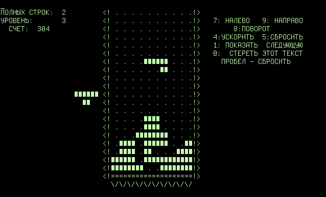
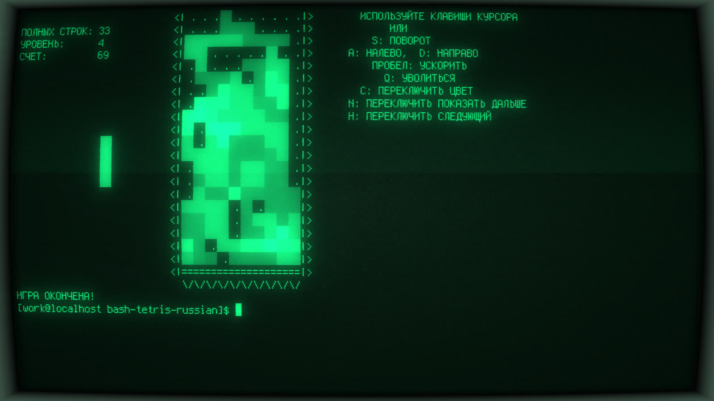

Tetris for Retro Term
===========

Tetris 1984 simulation with `cool-retro-term`.


### Original Tetris:



### Tetris 1984 With Cool-Retro-Term: 



## Usage
```text
./run-in-retro-term.sh -h
usage : ./run-in-retro-term.sh [-h] [-v]
-h   help
-v   verbose
```
Run `tetris` for executing in Retro Term with background playing [music](media/tetris-theme.ogg).


```bash
$ ./run-in-retro-term.sh  # will be start 
```

> This music file is licensed under the Creative Commons Attribution-Share Alike 3.0 Unported license. I get from [this source](https://commons.wikimedia.org/wiki/File:Tetris_theme.ogg) and I did not change the original file.


## Playing Video

<a href="https://www.youtube.com/watch?v=dO2xVWQj59k"></a>
